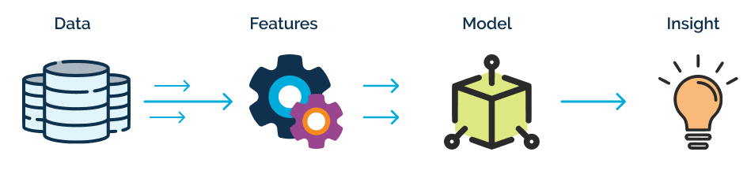

# Feature Engineering for Machine Learning

Learn imputation, variable encoding, discretization, feature extraction, how to work with datetime, outliers, and more. This is a course to learn and gain experience working with data and preparing datasets in order to used them to build and train Machine Learning models.

<p align="center">
  
</p>

The file structure of this project is the following:

```bash
📦 feature-engineering-course
 ┣ 📂 assets
 ┃ ┣ 📂 imgs
 ┃ ┣ 📂 pdfs
 ┃ ┃ ┣ 📂 Feature-Engineering-Course-Presentations
 ┃ ┃ ┃ ┣ 📂 Section_02_VariableTypes
 ┃ ┃ ┃ ┣ 📂 Section_03_VariableCharacteristics
 ┃ ┃ ┃ ┣ 📂 Section_04_MissingImputation
 ┃ ┃ ┃ ┣ 📂 Section_05_MultivariateImputation
 ┃ ┃ ┃ ┣ 📂 Section_06_CategoricalEncoding
 ┃ ┃ ┃ ┣ 📂 Section_07_VariableTransformation
 ┃ ┃ ┃ ┣ 📂 Section_08_Discretisation
 ┃ ┃ ┃ ┣ 📂 Section_09_OutlierEngineering
 ┃ ┃ ┃ ┣ 📂 Section_10_FeatureScaling
 ┃ ┃ ┃ ┣ 📂 Section_11_MixedVariables
 ┃ ┃ ┃ ┣ 📂 Section_12_EngineeringDatetime
 ┃ ┃ ┃ ┣ 📂 Section_13_AssemblingPipeline
 ┣ 📂 data
 ┃ ┗  📜 README.md
 ┣ 📜 Pipfile
 ┣ 📜 Pipfile.lock
 ┗ 📜 README.md
```

This course is given by [Soledad Galli](https://www.udemy.com/course/feature-engineering-for-machine-learning/#instructor-1), in order to know more about this course and its content refer to [Feature Engineering for Machine Learning](https://www.udemy.com/course/feature-engineering-for-machine-learning/).