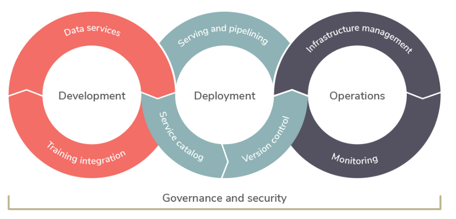

# **Machine Learning Operations (MLOps)**

**MLOps** is an ML engineering culture and practice that aims at unifying ML system development (Dev) and ML system operation (Ops). Practicing MLOps means that you advocate for automation and monitoring at all steps of ML system construction, including integration, testing, releasing, deployment and infrastructure management.

  

## Advantages of MLOps
Some of the advantages offered by the MLOps culture and process are as follows:

- Deploy more models faster with automated processes.
- Accelerate time-to-value with rapid model delivery.
- Optimize productivity through collaboration and model reuse.
- Reduce the risk of wasting time and money on models that never go into production.
- Continuously monitor and update models as data evolves over time.

## Challenges of MLOps

Managing these systems at scale is not an easy task, and there are numerous gaps that need to be addressed. A good MLOps policy solves challenges such as:

- The shortage of data scientists to develop and deploy scalable tools.
- Rapidly accepting changes to targets allowing to deliver value as quickly as possible.
- Bridging communication gaps between technical, data and business teams due to a known workflow.
- Facilitate risk management in the implementation of ML Models.

## Topics
Some relevant topics related to MLOps are:

- [Recap Charts](docs/recap_charts.md)
- [MLOps Documentation](docs/mlops_documentation.md)
- [MLOps Tools](docs/mlops_tools.md)
- [Customer Success Stories](docs/customer_sucess_stories.md)