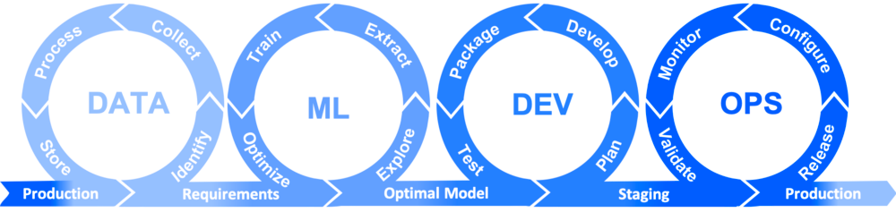
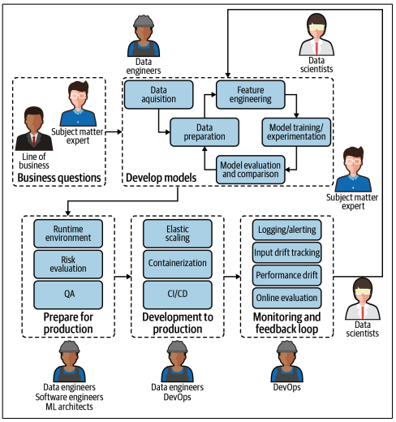
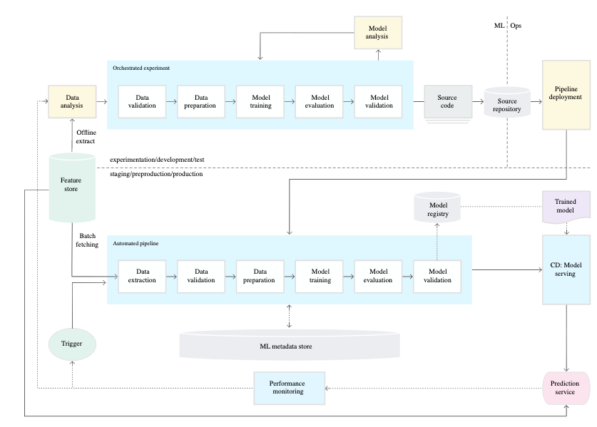
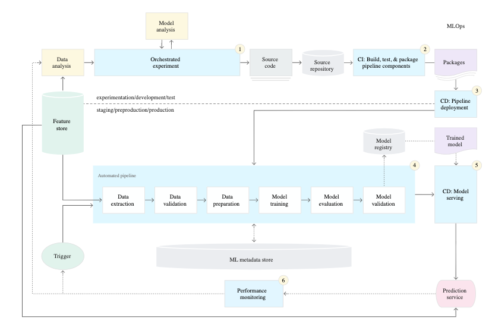

# Recap Charts

## Stages of the MLOps culture

  

## Roles of the MLOps lifecycle

  

## MLOps level 0: Manual process

  

## MLOps level 1: ML pipeline automation

  

## MLOps level 2: CI/CD pipeline automation

  

