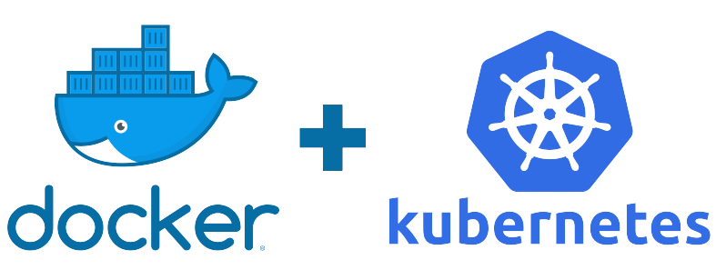

# Module 04 - Deployment
In this module of the MLOps ZoomCamp is going to be covered the different ways of deployment a model into production environments, in order to achieve this goal is going to be used Docker as the containerization tool.

<p align="center">
  
</p>

```bash 
# Files tree of the 04_deployment directory
.
|____README.md
|____notebooks # This directory contains the notebooks used in this module
|____scripts # This directory contains of the useful scripts to run this project 
```
There are different ways of deploy a Machine Learning model, the most popular are:

- Batch
- Streaming 
- Web Service

Based on the context and the application the ML model is deploy using one way or another, the **batch** approach is used when there is not a need of making predictions so often, this deployment is perfect when the predictions are made following a schedule like every year or every month. The **streaming** approach is used in real-time applications, and finally the **web service** approach is used when is needed an event based Machine Learning model.