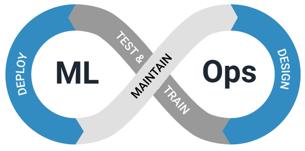

# MLOps ZoomCamp
This is a full course of MLOps where is covered a lot of practical aspects of productionizing ML services and collecting requirements to model deployment and monitoring.

<p align="center">
  
</p>

The file structure is the following:

```bash 
# Files tree of the mlops-zoomcamp directory
.
|____README.md
|____data # This directory contains the .parquet files (dataset)
|____assets # This directory contains some assets
|____01_introduction # First module of the course, the introduction to MLOps
|____02_experiment_tracking # Module two of the course, use of MLflow to keep tracking of the experiments metadata and model registry
|____03_orchestration # Module three of the course, use of Prefect as workflow orchestrator in order to build and implement ML pipelines effectively
```

## Instructors of the course
- Larysa Visengeriyeva
- Cristian Martinez
- Kevin Kho
- Theofilos Papapanagiotou
- Alexey Grigorev
- Emeli Dral
- Sejal Vaidya

Source of the course:
[MLOps Zoomcamp](https://github.com/DataTalksClub/mlops-zoomcamp)